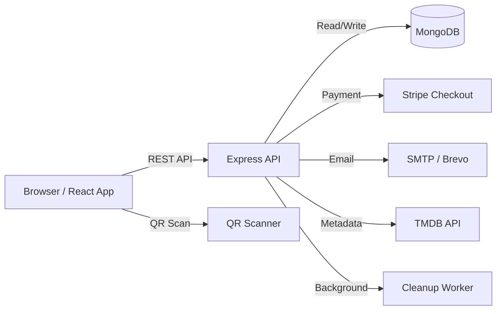
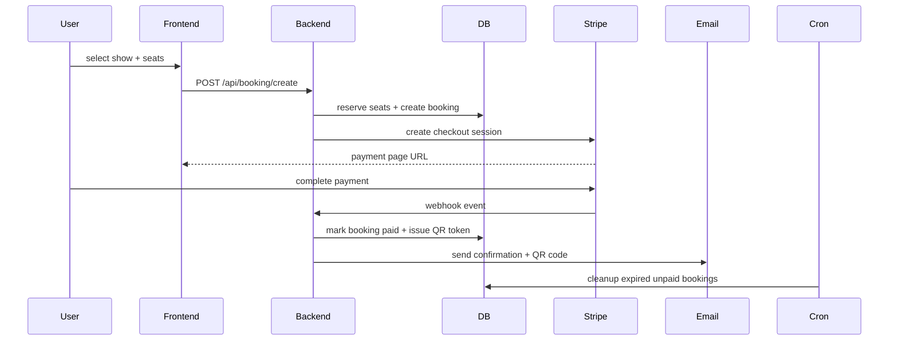

# ScreenFlow

ScreenFlow is a modern, backend-driven cinema booking platform that demonstrates operational workflow orchestration, payment-driven state transitions, and analytics-aware admin operations.

The application is built to showcase a complete system architecture with:
- ticket lifecycle management,
- seat recommendation and reservation logic,
- webhook-driven payment fulfillment,
- operational cleanup automation,
- and a multi-role admin dashboard.

## Why ScreenFlow Exists

ScreenFlow solves the real-world problem of ticket reservations, seat management, and check-in automation for cinema operators.
It was created to demonstrate the design and implementation of a system that is more than a CRUD app: it combines backend workflows, external integration, user session management, and operational reliability.

## Engineering Highlights

- **Transactional seat reservation** with `Show.occupiedSeats` and booking expiration management.
- **Payment orchestration** using Stripe Checkout and webhook-driven booking confirmation.
- **Operational cleanup worker** to reclaim unpaid bookings and release reserved seats.
- **Admin analytics layer** for bookings, active shows, revenue, and operational dashboard data.
- **Email automation** for registration, booking confirmation, and ticket delivery.
- **Movie metadata ingestion** from TMDB, synchronized into a local catalog.
- **Seat recommendation engine** that scores available seats to suggest the best option.
- **Role-based access control** with user and admin middleware.

## System Design

ScreenFlow uses a split architecture for frontend and backend responsibilities.

- The frontend is a React + Vite application that delivers the customer booking experience and admin dashboard.
- The backend is a Node.js + Express API layer responsible for data integrity, auth, booking workflows, external integration, and operational automation.
- MongoDB stores normalized movie and show catalogs, bookings, and user state.

### System Architecture



### Booking & Sync Pipeline



## Screenshots & Demo

The application supports the following flows:

- **Customer booking**: browse shows, select seats, and checkout via Stripe.
- **Seat guidance**: best-available seat recommendation based on occupancy.
- **Admin operations**: add showtimes, review active shows, and inspect bookings.
- **Operational check-in**: QR token validation for ticket scanning.

<p align="center">
  <a href="https://screenflow-puce.vercel.app/" target="_blank">
    
  </a>
  <a href="https://github.com/RohitChavan16/ScreenFlow" target="_blank">
    
  </a>
</p>
<br />
<p align="center">
  
</p>

<p align="center">
  
</p>

-----------------------------------------------------------------------------------------------------------------------------------------------------------------------------------------------------------------
<br />
<p align="center">
  
</p>

<p align="center">
  
</p>


-----------------------------------------------------------------------------------------------------------------------------------------------------------------------------------------------------------------
<br />


<p align="center">
  
</p>

<p align="center">
  
</p>


-----------------------------------------------------------------------------------------------------------------------------------------------------------------------------------------------------------------
<br />

<p align="center">
  
</p>

<p align="center">
  
</p>


-----------------------------------------------------------------------------------------------------------------------------------------------------------------------------------------------------------------

<br />
<p align="center">
  
</p>


<p align="center">
  
</p>


-----------------------------------------------------------------------------------------------------------------------------------------------------------------------------------------------------------------
<br />


<p align="center">
  
</p>

<br />
**Booking confirmation and ticket are sent to your email**
Frontend: http://localhost:5173
Backend: http://localhost:4000 (or your PORT)

<br />
## Folder Structure

- `client/` — React UI, route configuration, admin dashboard and user experience.
- `server/` — Express application, controllers, routes, models, middleware, and operational workers.
- `server/models/` — MongoDB schema models for `User`, `Movie`, `Show`, and `Booking`.
- `server/controllers/` — request handling, booking orchestration, auth workflows, and webhook processing.
- `server/middleware/` — session validation and admin authorization.
- `server/cron/` — seat cleanup and expired booking release worker.
- `server/utils/` — utility helpers for email delivery and seat recommendation.
- `docs/` — architecture documentation, deployment guides, API reference, and system strategy.

## Engineering Decisions

- **MongoDB for rapid evolution**: a flexible document model supports seat occupancy and booking metadata without extensive schema migration.
- **Stripe webhooks**: decoupling payment confirmation from booking requests ensures the reservation flow remains resilient and operationally clear.
- **Seat occupancy map**: storing `occupiedSeats` on `Show` allows constant-time checks during booking validation.
- **Admin route isolation**: admin operations are isolated through dedicated middleware and nested frontend routing.
- **Email-first notifications**: booking and registration confirmations are built as transactional notifications with QR token context.

## Performance & Scalability

- Seat availability checks are optimized through embedded occupancy maps.
- Show creation uses bulk insert operations to reduce write latency.
- The booking workflow is designed for eventual consistency with cleanup automation.
- Future scaling paths include worker-based email/webhook processing, caching hot show data, and sharding MongoDB by show time or screen.

## Observability & Operations

ScreenFlow is built to support operational awareness:

- **Cron monitoring**: logs for expired booking cleanup and seat release.
- **Webhook auditing**: Stripe events are processed with validation and error capture.
- **Runtime logs**: backend controllers log actionable state transitions for booking and admin operations.
- **Admin dashboard analytics**: revenue, booking counts, and active show summaries provide operational visibility.

## Deployment

ScreenFlow is deployable as a split frontend/backend topology.

### Local deployment

1. Backend: `cd server && npm install && npm run server`
2. Frontend: `cd client && npm install && npm run dev`
3. Configure:
   - `VITE_BACKEND_URL`
   - `VITE_CURRENCY`
   - `VITE_TMDB_IMAGE_BASE_URL`
   - backend auth, Stripe, SMTP, TMDB, and MongoDB variables


### Production-inspired deployment path

- Frontend served from a CDN or static host.
- Backend exposed behind a secure host with environment-backed configuration.
- MongoDB Atlas or managed cluster for production data.
- Stripe webhooks for payment lifecycle and ticket confirmation.
- SMTP relay for email delivery.

## Engineering Roadmap

Future evolutions include:

- distributed worker queues for webhook and email processing
- centralized metrics and logging for API latency and booking health
- Redis caching for show availability and booking session management
- containerized deployment for repeatable infrastructure
- expanded observability with telemetry dashboards

## Getting Started

See `docs/deployment.md` and `docs/api-reference.md` for setup and API details.

## Documentation

A complete engineering documentation set is available in `docs/`:
- `architecture.md`
- `backend-architecture.md`
- `frontend-architecture.md`
- `api-reference.md`
- `database-design.md`
- `deployment.md`
- `monitoring-observability.md`
- `scaling-strategy.md`
- `performance-optimization.md`
- `development-workflow.md`
- `contributing.md`

## 🤝 Contributing

1. Fork the repo
2. Create your feature branch (`git checkout -b feature/AmazingFeature`)
3. Commit changes (`git commit -m 'Add some AmazingFeature'`)
4. Push to branch (`git push origin feature/AmazingFeature`)
5. Open a Pull Request

## ⚙️ Installation & Setup

Follow these steps to set up the project locally 👇

1️⃣ Clone the Repository

```bash
git clone https://github.com/RohitChavan16/ScreenFlow.git
cd ScreenFlow
```

2️⃣ Backend Setup

```bash
cd server
npm install
```

Create a `.env` file in the `server` folder and add the following:

```
PORT=
MONGODB_URL=
JWT_SECRET=
NODE_ENV=
CLIENT_URL=
SMTP_USER=
SMTP_PASS=
SENDER_EMAIL=
TMDB_API_KEY=
STRIPE_PUBLISHABLE_KEY=
STRIPE_SECRET_KEY=
STRIPE_WEBHOOK_SECRET=
CLOUDINARY_CLOUD_NAME=
CLOUDINARY_API_KEY=
CLOUDINARY_API_SECRET=
```

Then start the server:

```bash
npm run dev
```

3️⃣ Frontend Setup

```bash
cd client
npm install
```

Create a `.env` file in the `client` folder:

```
VITE_BACKEND_URL=
VITE_CURRENCY='₹'
VITE_TMDB_IMAGE_BASE_URL=
```

Then run:

```bash
npm run dev
```

4️⃣ Open the app

Frontend: http://localhost:5173

Backend: http://localhost:4000

## MIT License

Copyright (c) 2025 Rohit Chavan

Permission is hereby granted, free of charge, to any person obtaining a copy
of this software and associated documentation files (the "Software"), to deal
in the Software without restriction, including without limitation the rights
to use, copy, modify, merge, publish, distribute, sublicense, and/or sell
copies of the Software, and to permit persons to whom the Software is
furnished to do so, subject to the following conditions:

The above copyright notice and this permission notice shall be included in all
copies or substantial portions of the Software.

THE SOFTWARE IS PROVIDED "AS IS", WITHOUT WARRANTY OF ANY KIND, EXPRESS OR
IMPLIED, INCLUDING BUT NOT LIMITED TO THE WARRANTIES OF MERCHANTABILITY,
FITNESS FOR A PARTICULAR PURPOSE AND NONINFRINGEMENT. IN NO EVENT SHALL THE
AUTHORS OR COPYRIGHT HOLDERS BE LIABLE FOR ANY CLAIM, DAMAGES OR OTHER
LIABILITY, WHETHER IN AN ACTION OF CONTRACT, TORT OR OTHERWISE, ARISING FROM,
OUT OF OR IN CONNECTION WITH THE SOFTWARE OR THE USE OR OTHER DEALINGS IN THE
SOFTWARE.

## Author
ROHIT CHAVAN

