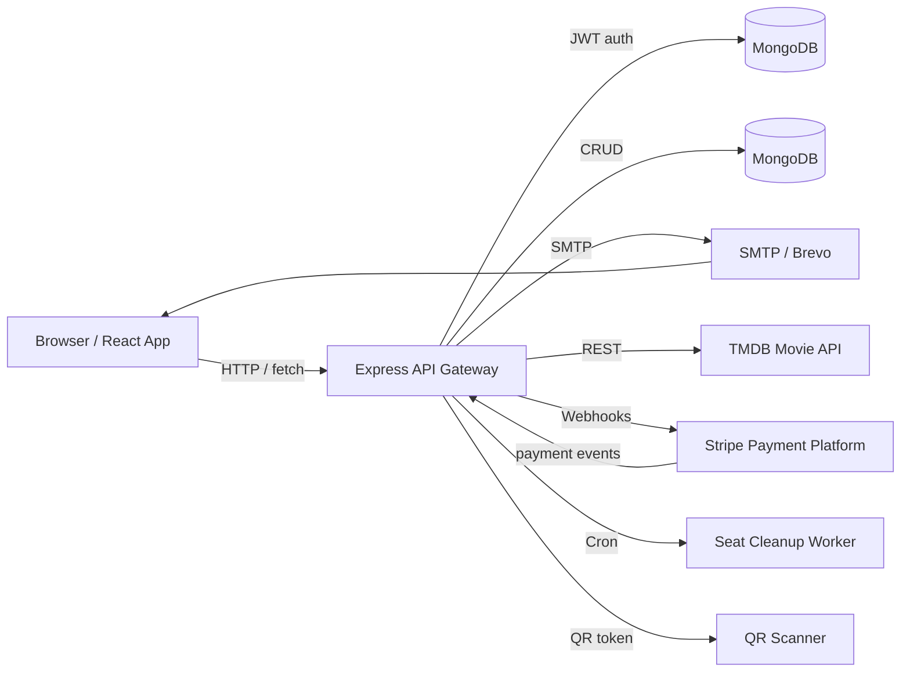
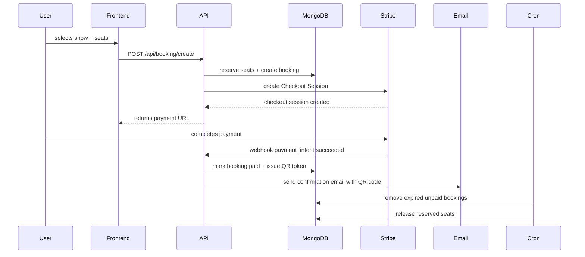

# Architecture Overview

ScreenFlow is architected as a clean separation between user-facing experience and backend orchestration. The system combines a modern React frontend with an Express-powered REST API, a MongoDB persistence layer, and event-driven operational services for payments, email automation, seat reservation, and check-in.

## Architecture Philosophy

- **Modular service layers**: clear separation of concerns between booking orchestration, user management, admin operations, and notifications.
- **Stateful application behavior with stateless APIs**: the frontend remains responsible for user session state, while backend APIs enforce authentication, authorization, and booking state transitions.
- **Operational automation**: background cleanup and webhook-driven workflows keep data consistency aligned with external events.
- **Scalable evolution**: the current design supports future migration to worker queues, containerized services, and multi-region deployments.

## Core Components

- `client/` — React application, route-driven UI, admin dashboard, seat layout experience, and checkout flow.
- `server/` — Node.js + Express REST API, authentication, booking pipeline, admin operations, and webhook processing.
- `server/models/` — MongoDB schema definitions for users, movies, shows, and bookings.
- `server/cron/bookingCleanup.js` — automated cleanup engine for expiring unpaid bookings.
- `server/controllers/stripeWebhooks.js` — payment capture, ticket confirmation, and QR code generation.
- `server/utils/seatRecommendation.js` — seat scoring algorithm for best available seating.

## System Flow Diagrams

### System Architecture



### Booking Sync Pipeline



### Request Flow

```mermaid
flowchart TD
  User -->|login/register| AuthRoute[/api/auth/*]
  User -->|browse shows| ShowRoute[/api/show/all]
  User -->|view show| ShowRoute[/api/show/:movieId]
  User -->|book seat| BookingRoute[/api/booking/create]
  Admin -->|dashboard| AdminRoute[/api/admin/dashboard]
  Admin -->|add show| AdminRoute[/api/show/add]
  Stripe -->|payment webhook| WebhookRoute[/api/stripe/*]
```

## Engineering Goals

- Deliver an operationally aware booking platform with a backend that is responsible for strong state transitions.
- Provide a scalable seat reservation model with a persistent occupancy map.
- Maintain separation between public browsing, authenticated user workflows, and admin operations.
- Keep payment and ticketing workflows decoupled via webhook-driven confirmation.
- Provide maintainable documentation and clear API boundaries for future contributors.
